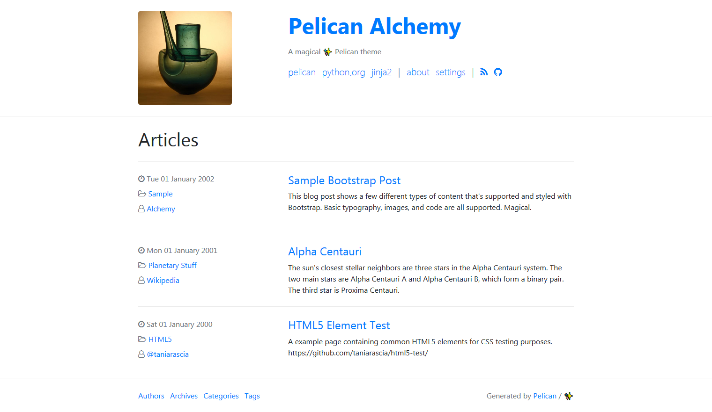
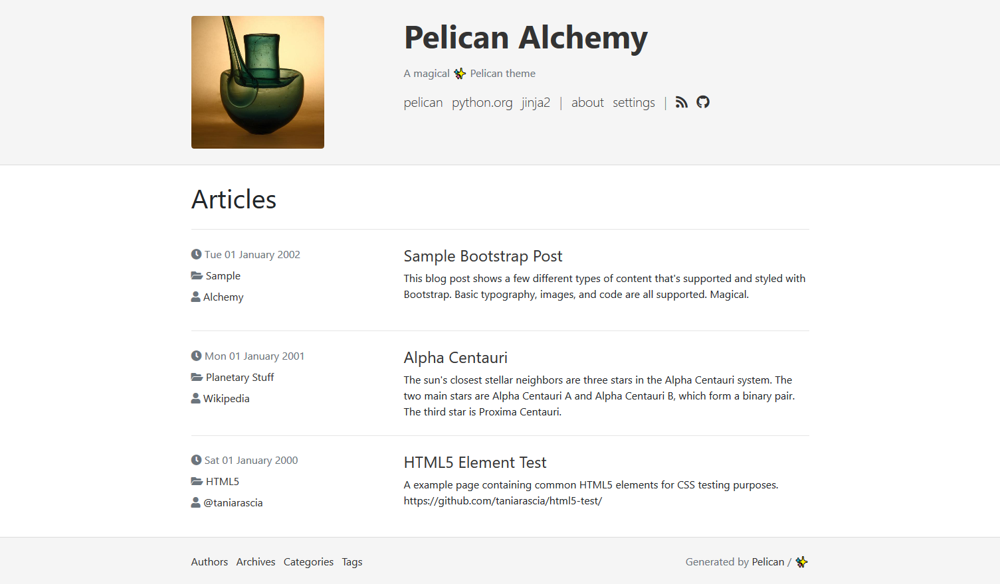
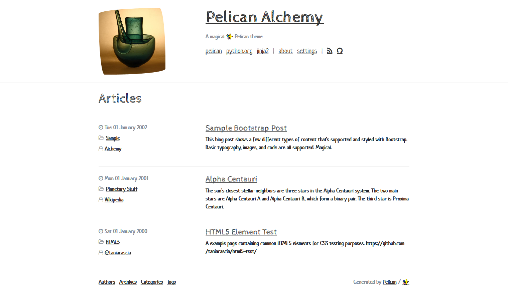
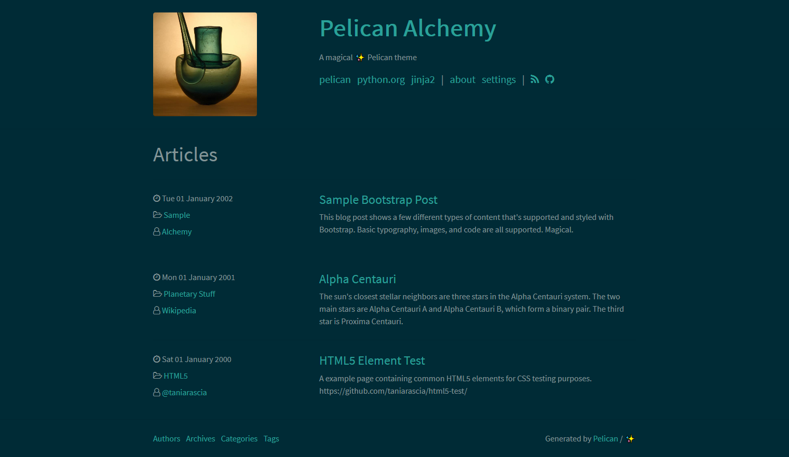
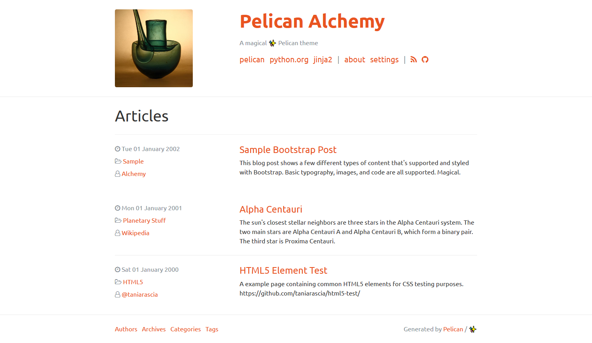

# Pelican Alchemy

> A magical ✨ Pelican theme

Alchemy is a functional, clean, responsive theme for the [Pelican](http://getpelican.com) static site generator.

Inspired by [crowsfoot](http://github.com/porterjamesj/crowsfoot) and [clean-blog](https://github.com/BlackrockDigital/startbootstrap-clean-blog), it features:

- Powered by [Bootstrap 4](https://getbootstrap.com/) (v4.3.1)
- Styled by CSS, not Javascript
- Supports any [Boostwatch](https://bootswatch.com/) themes if you want it to
- [Font Awesome](http://fontawesome.io/) icons
- [Pygments](http://pygments.org/) syntax highlighting styles
- Pelican `sitemap.xml` support
- [Favicon Generator](http://realfavicongenerator.net/) support


## Examples

### Live site

[Adapted as a Progressive Web Application](https://test.12voltfarm.com/)


### Screenshots

<table>
<tr>
  <td colspan="2">
    <a href="screenshots/default.png">
      
      <p align="center">Default colors</p>
    </a>
  </td>
</tr>
<tr>
  <td>
    <a href="screenshots/oldstyle.png">
      
      <p align="center">Old style (see below)</p>
    </a>
  </td>
  <td>
    <a href="screenshots/sketchy.png">
      
      <p align="center">Sketchy (Boostwatch)</p>
    </a>
  </td>
</tr>
<tr>
  <td>
    <a href="screenshots/solar.png">
      
      <p align="center">Solar (Boostwatch)</p>
    </a>
  </td>
  <td>
    <a href="screenshots/united.png">
      
      <p align="center">United (Boostwatch)</p>
    </a>
  </td>
</tr>
</table>

> To enable old visual style add `THEME_CSS_OVERRIDES = ['theme/css/oldstyle.css']`
> to your `pelicanconf.py` and use no Boostwatch themes.
> See [stylesheet](alchemy/static/css/oldstyle.css) for more information.

## Installation

Like all pelican themes, there are four ways of calling it:

### 1. From Git repo

In my opinion, this is the best long-term method to use.

Clone the repo:

```bash
git clone https://github.com/nairobilug/pelican-alchemy
```

Set the `THEME` variable in your Pelican config file: pelicanconf.py:

```python
THEME = '<PATH_TO_REPO>/alchemy'
```

### 2. As a Submodule

In your Pelican site:

```bash
mkdir themes
git submodule add https://github.com/nairobilug/pelican-alchemy themes/pelican-alchemy
```

And in Pelican config:

```python
THEME = 'themes/pelican-alchemy/alchemy'
```

### 3. With pip

Alternatively, you can install this theme with pip:

```bash
pip install "https://github.com/nairobilug/pelican-alchemy/tarball/master"
```

And import it from Pelican config file: pelicanconf.py:

```python
import alchemy
THEME = alchemy.path()
```

## Usage

1. Using Pelican-Alchemy as a Progressive Web Application
2. [Settings docs](docs/settings.md)
3. [Pelican-Alchemy Tips](docs/pelican-tips.md)
4. [Adding comments to a Pelican blog](docs/comments.md)


### Creating Progressive Web Applications (PWAs)

This theme comes with templates that build the various files required by PWAs. All you need to do is:

1. Add a variable anywhere in your pelicanconf.py file called 'PWA'. Set it to True if you want your site created as a PWA. Set it to False if you want your site as an ordinary website. Eg:

```
PWA = True
```

2. Copy all the files from the theme's 'pwa_pages/' directory into your pelican 'content/pages/' directory. Make a 'content/pages/' folder if you don't have one. That done, edit the 'manifest.md' file's metadata to set the details of your PWA's own manifest.json file. The manifest.md metadata tags that matter are:

- name:
- short_name:
- description:

Also, change your icon image files to images of your own.

That's all you need to build a basic PWA. In its current form, Pelican-Alchemy-PWA will not push-notify users. But it will allow them to choose to install your content as a PWA on their homescreen.

Beyond that, there are a lot of options with PWAs, particularly their look and feel. Read the 'manifest.md' file to get an understanding.

Pelican-Alchemy-PWA comes with various basic service-worker templates. Read the service-worker.md file from 'pwa_pages/' to understand what they do.

#### How does Pelican-Alchemy-PWA work?

The three '.md' files in the theme's pwa_pages/ directory force pelican to build the javascript and manifest.json files required by all PWAs. Inspect the cmetadata tags of the '.md' files in 'pwa_pages' to see how this is done. It's simply exploiting how Pelican handles the 'template' and 'save_as' metadata tags in *content* files.

The pelicanconf.py 'PWA = True' option simply tells Pelican to include calls to the created PWA files in the site's web page headers. The 'False' option tells it not to call them. So 'True' or 'False' toggles PWA-ness on and off.

It's pretty straightforward.

When you want to experiment further, there is more guidance in each of the three 'pwa_pages/' files.

### Settings

Visit the [Settings docs](docs/settings.md) for examples:

- **SITESUBTITLE**: Subtitle that appears in the header.
- **SITEIMAGE**: Image that appears in the header.
- **DESCRIPTION**: Index HTML head `<meta>` description.
- **LINKS**: A list of tuples (Title, URL) for menu links.
- **ICONS**: A list of tuples (Icon, URL) for icon links. Icons are assumed to
  be Font Awesome brand icons, if you need to use icons from other Font
  Awesome icon set please provide full [CSS class], e.g. `fas fa-camera`
  instead on just `camera`
- **FOOTER_LINKS**: A list of tuples (Title, URL) for footer links. Replaces
  default set of links (Authors, Archives, Categories, Tags).
- **BOOTSTRAP_CSS**: URL of Bootstrap CSS file. Use this to enable Boostwatch themes.
- **FONTAWESOME_CSS**: URL of Font Awesome CSS file. Use this if you wish to
  use CDN provided version instead of the bundled one.
- **PYGMENTS_STYLE**: Built-in Pygments style for syntax highlighting.
- **HIDE_AUTHORS**: Hide the author(s) of an article - useful for single author sites.
- **RFG_FAVICONS**: Use a Favicon Generator package.
- **THEME_CSS_OVERRIDES**: Sequence of stylesheet URLs to override CSS provided by theme.
  Both relative and absolute URLs are supported.
- **THEME_JS_OVERRIDES**: Sequence of JavaScript URLs to enable with this
  theme. Alchemy uses no JS by default. Both relative and absolute URLs are
  supported.

[CSS class]: [https://fontawesome.com/how-to-use/on-the-web/referencing-icons/basic-use](https://fontawesome.com/how-to-use/on-the-web/referencing-icons/basic-use)

Misc settings:

- **DISQUS_SITENAME**
- **GAUGES**
- **GOOGLE_ANALYTICS**
- **PIWIK_URL**
- **PIWIK_SITE_ID**


### Tips & Tricks

[Pelican-Alchemy Tips](docs/pelican-tips.md)

### Adding comments

[Adding comments to Pelican blog](docs/comments.md)


## How to Contribute

1. Check for open issues or open a fresh issue to start a discussion around a feature idea or a bug.
1. Fork [the repository](https://github.com/leekimber/pelican-alchemy) on GitHub to start making your changes to the master branch (or branch off of it).
1. Send a pull request and bug the maintainer until it gets merged and published. :)

Alchemy follows the [Contributor Covenant](CODE_OF_CONDUCT.md) code of conduct.

## License

[MIT](LICENSE) © 2017 Nairobi GNU/Linux Users Group
